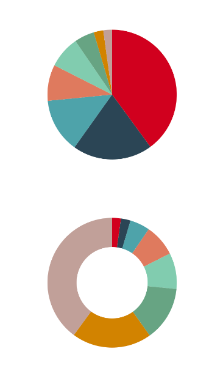

# react-native-animated-pie

Animated Pie chart for React Native，use **ART** and **Animated**

## Demo



## Install

1. `npm i --save react-native-animated-pie`
2. Link the ART library to your ReactNative project ([how to link a library](https://facebook.github.io/react-native/docs/linking-libraries-ios.html#content)). You'll find the React ART library in `node_modules/react-native/Libraries/ART/ART.xcodeproj`


## Usage

```jsx
// @flow
import * as React from "react";
import { ScrollView, Easing } from "react-native";

import Pie from "react-native-animated-pie";

export default class PieExample extends React.Component<any> {
  render() {
    const series = [40, 12, 68, 100, 25, 45, 200, 11];
    const delay = 0;
    return (
      <ScrollView>
        <Pie
          series={series.map(d => d).sort((a, b) => b - a)}
          height={380}
          outerRadius={100}
          easing={Easing.linear}
          delay={delay}
        />
        <Pie
          series={series.map(d => d).sort((a, b) => a - b)}
          outerRadius={100}
          height={200}
          innerRadius={55}
          delay={delay + 1000}
          easing={Easing.circle}
        />
      </ScrollView>
    );
  }
}
```

## Props

**`series`**: `Array<number | string>` dataset, `required`

**`width`**?: `number` default `window width`

**`height`**?: `number` default `width`

**`outerRadius`**?: `number` default `width / 2`

**`innerRadius`**?: `number` default `0`

**`x`**?: `number` coordinate of pie center, default `width / 2`

**`y`**?: `number` coordinate of pie center, default height / 2

**`colors`**?: `Array<string>` colors, check `src/constants.js` for default colors

**`delay`**?: `number` animation delay, default `0ms`

**`animate`**?: `boolean` animation or not, default `true`

**`duration`**?: `number` animation duration, default `1000ms`

**`easing`**?: `Function` easing func, default `Easing.out(Easing.cubic)`

## License

MIT